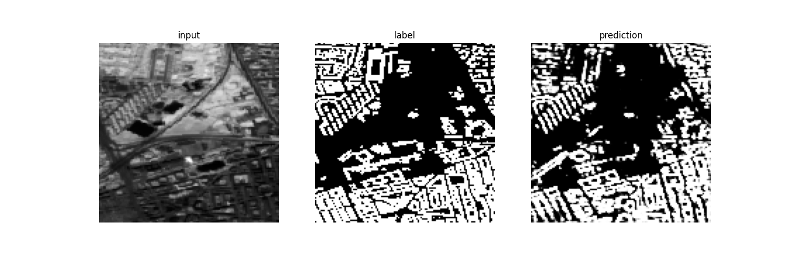

# Sentinel Building Segmentation

*U-Net prediction for Sentinel-2 image data (red channel displayed).*
Binary segmentation of buildings, given satellite imagery of cities from the Sentinel Copernicus program. The code includes a pipeline for the sattelite imagery and corresponding reference data (building masks). Semantic segmentation is conducted with a simple convolutional network (ConvNet) as a baseline model and with an U-Net model.

## Setup

1.  In the project root create a new virtual environment:
    ```bash
    python3 -m venv .venv
    ```
2.  Activate virtual environment:
    ```bash
    source .venv/bin/activate
    ```
3.  Install requirements:
    ```bash
    python -m pip install --upgrade pip
    python -m pip install -r requirements.txt
    ```

## How to use the code
The code is executable via `main.py`. It contains a `main()` function that can be called via the command line. The entire pipeline is callable with:
```bash
python main.py
```
It comprises the data acquisition, the hyperparameter optimization with the **baseline ConvNet model**, the hyperparameter optimization with the **U-Net model**, and data augmentation tests with both models. The data acquisition can be started with the additional command line parameter `acq` and if the plots for the downloaded satellite images are required, they can be displayed and saved with `acq plot`. After the acquisition is performed, a hyperparameter optimization with either ConvNet, or U-Net can be started, with the parameters `convnet hyper`, or `unet hyper`, respectively. If the training and testing of the models without hyperparameter optimization is desired, this can be achieved by passing simply `convnet` or `unet`. Furthermore, the impact of several data augmentation techniques can be explored with the command line parameters `convnet augment`, or `unet augment`. The module responsible for the data acquisition is `acquisition.py`. The data is pre-processed mostly in `dataset.py`. The models can be found in `models.py`, while the hyperparameter optimization, simple training, or augmentation are started from `train_apply.py`. The module `train_test.py` is responsible for training, validation, and testing. The functions for augmentation are in the module `augment.py`. Almost all parameters used in the entire program are stored globally in the `params.py` module, to simplify their adjustment. For instance, the data paths, city lists, and other hyperparameters used in training and testing, can be found here.

## Threading error
Sometimes on CPU a threading error occurs. To mitigate this, before executing `main.py`, run in the command line:
```bash
export OMP_NUM_THREADS=1
export MKL_NUM_THREADS=1
```
## Credits
Ronneberger, O., Fischer, P., & Brox, T. (2015). **U-Net: Convolutional Networks for Biomedical Image Segmentation.** MICCAI. https://arxiv.org/abs/1505.04597
